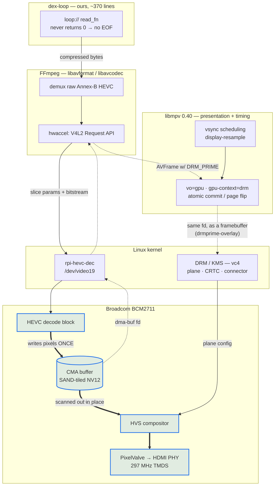

# dex-loop

Gapless HEVC looper for the Raspberry Pi. One process, no dependencies, no shell.

```bash
# once, at ingest -- mpv needs a raw elementary stream, not MP4:
ffmpeg -i card.mp4 -c:v copy -bsf:v hevc_mp4toannexb -f hevc loop.265
# and the binding sidecar (fps + hash travel WITH the asset):
printf '{"fps":"30","sha256":"%s","width":3840,"height":2160}\n' \
  "$(shasum -a 256 loop.265 | cut -d' ' -f1)" > loop.265.json   # Linux: sha256sum

# then
dex-loop loop.265 --mode 3840x2160@30
```

## What it does

Feeds libmpv a byte stream that never ends, by registering a `loop://` protocol
whose read callback wraps back to byte 0 instead of ever returning EOF.

That single property is the whole point. Every mpv looping mechanism stalls at
the wrap because each one makes the decoder **re-enter** the file; measured on a
Pi 4 against an HDMI capture card:

| mechanism | hold at the wrap |
|---|---|
| `--loop-file=inf` | 83 ms, every loop |
| `--ab-loop-a/b` | 83 ms, identical |
| `--playlist` + `--prefetch-playlist` | 117-133 ms, worse |
| `ffmpeg -stream_loop` + `vout_drm` | 67-217 ms, 3 per loop |
| `--loop-file=inf` on a raw `.265` | freezes on the last frame |
| **endless stream (this)** | **none** |

It works because a correctly-built bench asset has a **closed GOP with an IDR at
frame 0**, so presenting byte 0 straight after the last byte is an ordinary
mid-stream keyframe rather than a seek.

## The stack, and where each layer stops

```
  ┌────────────────────────────────────────────────────────────────────────┐
  │ dex-loop                                    OURS — ~370 lines of Rust  │
  │   loop:// stream callback; read_fn never returns 0, so there is no EOF │
  │   option set · END_FILE treated as fatal · mpv log capture             │
  └────────────────────────────────────────────────────────────────────────┘
                      │  mpv client API  (mpv_stream_cb_add_ro, loadfile)
  ┌────────────────────────────────────────────────────────────────────────┐
  │ libmpv 0.40                              PRESENTATION + TIMING         │
  │   vsync-locked scheduling  (--video-sync=display-resample)             │
  │   vo=gpu / gpu-context=drm — modeset, atomic commits, page flips       │
  │   --gpu-hwdec-interop=drmprime-overlay — hands the frame to a KMS plane│
  └────────────────────────────────────────────────────────────────────────┘
                      │  libav* API
  ┌────────────────────────────────────────────────────────────────────────┐
  │ FFmpeg — libavformat / libavcodec              DEMUX + DECODE          │
  │   raw Annex-B HEVC demux (carries no timestamps, hence --fps)          │
  │   hwaccel: V4L2 Request API (stateless)                                │
  └────────────────────────────────────────────────────────────────────────┘
                      │  ioctl
  ┌────────────────────────────────────────────────────────────────────────┐
  │ Linux kernel                                                           │
  │                                                                        │
  │   V4L2 stateless decoder  ──── dma-buf ────▶  DRM / KMS  (vc4)         │
  │   rpi-hevc-dec                (DRM_PRIME)     planes · CRTC pixelvalve-2│
  │   /dev/video19                                connector HDMI-A-1       │
  └────────────────────────────────────────────────────────────────────────┘
                      │
  ┌────────────────────────────────────────────────────────────────────────┐
  │ Broadcom BCM2711                                                       │
  │   HEVC decode block ──▶ SAND-tiled NV12, in CMA                        │
  │                              │  no conversion: the HVS reads SAND      │
  │   HVS (compositor) ──▶ PixelValve ──▶ HDMI PHY  @ 297 MHz TMDS         │
  └────────────────────────────────────────────────────────────────────────┘
```

**Read the arrows carefully: the decoded frame never travels back up the stack.**
It is written once into CMA by the HEVC block and stays there. What moves upward
is a *dma-buf file descriptor*; libmpv hands that to KMS as a framebuffer, and
the HVS scans the same memory out. Control flows down; pixels move sideways at
the bottom.

That is the whole performance story, and every configuration that lost was one
that dragged the frame upward:

| Path | What touches the frame | Result |
|---|---|---|
| `--hwdec=drm-copy` | CPU detiles SAND into linear NV12 | 14.3 fps |
| `--gpu-hwdec-interop=drmprime` (GL) | V3D samples SAND as a texture | ~5 fps |
| **`drmprime-overlay`** | **nothing — fd straight to a KMS plane** | **29.1 fps** |

It also explains the two upstream gaps we hit: GStreamer's `kmssink` cannot bind
a SAND dma-buf at all (so it falls back to dumb-buffer copies and OOMs at 4K),
and mpv's `--hwdec=drm` with `--vo=drm` silently selects the software decoder
rather than the plane path.


## How a frame actually travels

The layer stack above answers "who owns what". It cannot show the *path*, because
the path is not a stack — it is a loop. Compressed bytes go **down**, a file
descriptor comes **up**, and the pixels never move at all:



**Legend.** Thin arrows are compressed data and control. Dotted arrows carry a
*file descriptor*, not pixels. Thick arrows are the only places actual pixels
move — and note they all live in the bottom box.

The frame is written into CMA once by the HEVC block and is scanned out from
that same memory by the HVS. Everything in between is passing a handle around.
That is what "zero-copy" means here, concretely.

## Measured

4K30 HEVC on a Pi 4 (trixie), captured over HDMI and decoded frame-by-frame:

```
dwell={1: 1500}  wraps=19  held_at=[]     # every capture a distinct frame index
```

Identical to `while true; do cat loop.265; done | mpv -`, which is the reference
this replaces. Memory is flat (221 MB RSS, unchanged over 20 s; mpv's demuxer
cache is bounded by `--demuxer-max-bytes`), and a 3.5 h soak of the equivalent
shell pipeline showed no held frames and no growth.

## Why not the shell pipeline, then

`while true; do cat loop.265; done | mpv -` is correct but not shippable:

* a process per loop -- roughly 29,000/day for a 3 s card
* if mpv ever exits, `cat` dies on SIGPIPE and the `while` loop **spins hot**,
  burning a core indefinitely. A dex player would go from "video stopped" to
  "CPU pegged forever"

## Why not Python

The identical design in Python (`../scripts/loop-player.py`, kept for reference)
displays correctly but runs at **0.6x realtime**, with frames held at random
points across the loop -- the signature of a starved feed rather than a seam.
The stream has to deliver ~5 MB/s against hard per-frame deadlines, and a ctypes
callback under the GIL cannot promise that. libmpv's `stream_cb` is a C API, so
in Rust the same callback is a `copy_nonoverlapping`.

## Options and the sidecar

`dex-loop <asset>` requires `<asset>.json` next to the asset — written at ingest,
binding the two facts that are undetectable when wrong: the frame rate (a raw stream
has no timestamps; a wrong rate plays slow forever with every metric nominal) and the
exact bytes (sha256 — a truncated copy glitches at every wrap).

```json
{"fps":"30","sha256":"<64 hex>","width":3840,"height":2160}
```

`fps` is a string (`"30"`, `"29.97"`, `"30000/1001"`), passed verbatim to mpv.
Required: `fps`, `sha256`. Optional: `width`, `height`, `source`, `encoder_cmd`.
Unknown keys are ignored — but their *values* still must be strings or unsigned
integers, the same subset `fps`/`sha256` use (arrays/booleans/null/nested objects
are refused everywhere, not just on the required keys). String escapes include
`\uXXXX` (standard JSON, surrogate pairs included), so a `source`/`encoder_cmd`
value produced by a default-safe serializer (Python's `json.dumps`, Go's
`encoding/json`) does not break startup on a non-ASCII byte. Anything outside the
subset refuses startup — fail closed.

| flag | meaning |
|---|---|
| `--fps F` | optional cross-check; must equal the sidecar fps exactly, or startup is refused |
| `--mode WxH@R` | force a DRM mode, e.g. `3840x2160@30`. Default: connector preferred. Deliberately NOT in the sidecar: mode is venue config, not asset metadata |
| `--bench-no-sidecar` | BENCH ONLY: skip the sidecar and take `--fps` as given (both flags required — the escape hatch is a deliberate two-flag act) |
| `--opt K=V` | pass any extra mpv option (repeatable) |
| `--no-defaults` | omit the built-in Pi 4 zero-copy option set |

Startup gates, in order: asset readable and non-empty → sidecar parses → fps resolved →
sha256 matches → leading NALs are VPS/SPS/PPS + IDR (open-GOP/CRA assets are refused —
the wrap premise is "IDR at frame 0") → every `--opt`/default/`--mode` mpv option is
accepted. Exit codes: **2** = refused before playback (fix the asset/invocation —
including a rejected mpv option; restarting cannot help), **1** = playback/runtime
failure (the supervisor restarts). Every start logs `dex-loop <version> (<git hash>)`
and a heartbeat line (`wraps=`, `temp=`, `frame-drops=`) at boot and every 10 minutes.

The defaults encode the measured zero-copy path: the Pi's decoder emits
Broadcom SAND-tiled NV12, and the display scans SAND out natively **only**
straight onto a KMS plane. `--gpu-hwdec-interop=drmprime-overlay` is what puts
it there; plain `drmprime` imports into GL and is 2x slower (5 fps vs 29).

## Building

```bash
sudo apt install rustc cargo libmpv-dev   # trixie: rustc 1.85
cargo build --release                     # ~30 s on a Pi 4, no dependencies
```

## Testing

```bash
# Mac (no libmpv): type-check everything, run the pure-logic tests
cargo check --all-targets && cargo test --lib

# Pi (dexpi@dexpi4.local, crate mirrored at ~/bench/dex-loop): full suite
cargo test
```

The integration tests (`tests/cli.rs`, `tests/ffi_constants.rs`) link libmpv and spawn
the real binary — Pi only. They never touch the display: every playback-reaching
invocation uses `--no-defaults --opt vo=null --opt vid=no --opt aid=no`, so they are
safe to run while a soak owns the screen (`nice -n 19 cargo test` to keep builds off
the soak's CPU). See IMPLEMENTATION-PLAN.md for the full hardening rationale.

## Reviewed 2026-08-15

Three adversarial reviews (Rust/unsafe soundness, libmpv API contract, gallery
operations). Fixed since: the event loop ignored `MPV_EVENT_END_FILE`, and
because `mpv_create` enables idle mode by default, ANY playback failure left the
process alive in idle **forever** on a black screen -- strictly worse than
crashing, and the most likely gallery failure (projector not awake at boot) hit
exactly that path. `user_data` pointed at a stack local; `read_fn` could return 0
(= final EOF) for a zero-length request; `seek_fn`/`size_fn` used `-1` rather
than the documented `MPV_ERROR_UNSUPPORTED`; software decode could fall back
silently; mpv's diagnostics went nowhere.

Still outstanding (see the story): asset+fps binding via an ingest sidecar,
read-only rootfs, and a frame-advance watchdog.

**Second pass, same day**, after F3/F4/F7 landed and three more adversarial reviews
ran against that hardening: `--fps`/`--mode` with a missing value no longer evaporate
silently (they refused via `usage()`, matching `--opt`); a rejected mpv option now
exits 2, not 1 (it is a deterministic, operator-fixable bad invocation, not a runtime
failure the supervisor's restart loop could resolve); the event loop now treats
`MPV_EVENT_QUEUE_OVERFLOW` as fatal too, since mpv's internal event ring silently
drops events — potentially an END_FILE — once it chokes; sidecar strings support
`\uXXXX` escapes (surrogate pairs included), because a default-safe JSON serializer
escapes every non-ASCII byte that way, including inside informational keys this
player does not even interpret; the heartbeat's sub-zero temperature formatting no
longer drops the sign; and `build.rs` now also reruns on source changes (not just
`.git/HEAD`) and can take its git hash from a `.dex-build-id` stamp file, since the
Pi build is an rsync mirror, not a checkout, and `git rev-parse` there always failed.

## Deployment

`deploy/` carries the systemd unit and the HDMI connector wait. The unit's
`StartLimitIntervalSec=0` is load-bearing: the default rate limit would put the
service into a permanent `failed` state after a burst of crashes, which is the
unattended failure this is meant to prevent. A restart loop always beats a dead
screen.

The primary boot-order fix is at the KMS layer, not in the player -- bake the
projector's EDID into `cmdline.txt` so the Pi always believes a 4K30 display is
attached. See the comments in `deploy/dex-wait-hdmi`.

**Triage.** Every refusal and every runtime failure is journal-only today (see
PLAN.md's F8): on site this reads as a plain black rectangle, so start with
`journalctl -u dex-loop -n 20` for the last startup line, the gate that refused
(if exit 2), or the `playback ended (reason=..., error=...)` line (if exit 1).

## Caveats

* **Raw Annex-B only.** MP4 in, `.265` out, once at ingest (milestone 3).
* **Frame rate is metadata now.** A raw stream has no timestamps, so `--fps`
  must accompany the asset.
* **No seeking, by construction.** `seek_fn` and `size_fn` deliberately report
  unseekable/unknown, exactly like a pipe: an mpv that believes it can seek will
  try to, and seeking is the operation that produces the seam. Fine for dex,
  which only ever loops; disqualifying for a general-purpose player.
