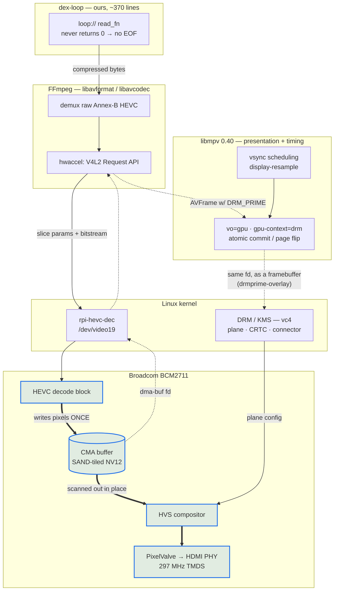

# dex-loop

Gapless HEVC looper for the Raspberry Pi. One process, no shell, and a dependency
set small enough to read — all of it declared (SPEC §5c). It links libmpv, so the
honest count is 228 shared objects, not zero.

```bash
# once, at ingest -- mpv needs a raw elementary stream, not MP4:
ffmpeg -i card.mp4 -c:v copy -bsf:v hevc_mp4toannexb -f hevc loop.265
# and the binding sidecar (fps + hash travel WITH the asset):
dex-sidecar write loop.265 --fps 30

# once, on the device -- WHICH asset and WHICH display mode are both exhibit
# config, not asset metadata (F6). /opt/dex/exhibit.json, or .yaml if you want
# comments; the .deb ships a stock .json.
printf '{"asset":"/opt/dex/loop.265","display_mode":"3840x2160@30"}\n' \
  | sudo tee /opt/dex/exhibit.json

# then -- no arguments: the exhibit says what to play and how
dex-loop
```

## What it does

Feeds libmpv a byte stream that never ends, by registering a `loop://` protocol
whose read callback wraps back to byte 0 instead of ever returning EOF.

That single property is the whole point. Every mpv looping mechanism stalls at
the wrap because each one makes the decoder **re-enter** the file; measured on a
Pi 4 against an HDMI capture card:

| mechanism | hold at the wrap |
|---|---|
| `--loop-file=inf` | 83 ms, every loop |
| `--ab-loop-a/b` | 83 ms, identical |
| `--playlist` + `--prefetch-playlist` | 117-133 ms, worse |
| `ffmpeg -stream_loop` + `vout_drm` | 67-217 ms, 3 per loop |
| `--loop-file=inf` on a raw `.265` | freezes on the last frame |
| **endless stream (this)** | **none** |

It works because a correctly-built bench asset has a **closed GOP with an IDR at
frame 0**, so presenting byte 0 straight after the last byte is an ordinary
mid-stream keyframe rather than a seek.

## The stack, and where each layer stops

```
  ┌────────────────────────────────────────────────────────────────────────┐
  │ dex-loop                                    OURS — ~370 lines of Rust  │
  │   loop:// stream callback; read_fn never returns 0, so there is no EOF │
  │   option set · END_FILE treated as fatal · mpv log capture             │
  └────────────────────────────────────────────────────────────────────────┘
                      │  mpv client API  (mpv_stream_cb_add_ro, loadfile)
  ┌────────────────────────────────────────────────────────────────────────┐
  │ libmpv 0.40                              PRESENTATION + TIMING         │
  │   vsync-locked scheduling  (--video-sync=display-resample)             │
  │   vo=gpu / gpu-context=drm — modeset, atomic commits, page flips       │
  │   --gpu-hwdec-interop=drmprime-overlay — hands the frame to a KMS plane│
  └────────────────────────────────────────────────────────────────────────┘
                      │  libav* API
  ┌────────────────────────────────────────────────────────────────────────┐
  │ FFmpeg — libavformat / libavcodec              DEMUX + DECODE          │
  │   raw Annex-B HEVC demux (carries no timestamps, hence --fps)          │
  │   hwaccel: V4L2 Request API (stateless)                                │
  └────────────────────────────────────────────────────────────────────────┘
                      │  ioctl
  ┌────────────────────────────────────────────────────────────────────────┐
  │ Linux kernel                                                           │
  │                                                                        │
  │   V4L2 stateless decoder  ──── dma-buf ────▶  DRM / KMS  (vc4)         │
  │   rpi-hevc-dec                (DRM_PRIME)     planes · CRTC pixelvalve-2│
  │   /dev/video19                                connector HDMI-A-1       │
  └────────────────────────────────────────────────────────────────────────┘
                      │
  ┌────────────────────────────────────────────────────────────────────────┐
  │ Broadcom BCM2711                                                       │
  │   HEVC decode block ──▶ SAND-tiled NV12, in CMA                        │
  │                              │  no conversion: the HVS reads SAND      │
  │   HVS (compositor) ──▶ PixelValve ──▶ HDMI PHY  @ 297 MHz TMDS         │
  └────────────────────────────────────────────────────────────────────────┘
```

**Read the arrows carefully: the decoded frame never travels back up the stack.**
It is written once into CMA by the HEVC block and stays there. What moves upward
is a *dma-buf file descriptor*; libmpv hands that to KMS as a framebuffer, and
the HVS scans the same memory out. Control flows down; pixels move sideways at
the bottom.

That is the whole performance story, and every configuration that lost was one
that dragged the frame upward:

| Path | What touches the frame | Result |
|---|---|---|
| `--hwdec=drm-copy` | CPU detiles SAND into linear NV12 | 14.3 fps |
| `--gpu-hwdec-interop=drmprime` (GL) | V3D samples SAND as a texture | ~5 fps |
| **`drmprime-overlay`** | **nothing — fd straight to a KMS plane** | **29.1 fps** |

It also explains the two upstream gaps we hit: GStreamer's `kmssink` cannot bind
a SAND dma-buf at all (so it falls back to dumb-buffer copies and OOMs at 4K),
and mpv's `--hwdec=drm` with `--vo=drm` silently selects the software decoder
rather than the plane path.


## How a frame actually travels

The layer stack above answers "who owns what". It cannot show the *path*, because
the path is not a stack — it is a loop. Compressed bytes go **down**, a file
descriptor comes **up**, and the pixels never move at all:



**Legend.** Thin arrows are compressed data and control. Dotted arrows carry a
*file descriptor*, not pixels. Thick arrows are the only places actual pixels
move — and note they all live in the bottom box.

The frame is written into CMA once by the HEVC block and is scanned out from
that same memory by the HVS. Everything in between is passing a handle around.
That is what "zero-copy" means here, concretely.

## Measured

4K30 HEVC on a Pi 4 (trixie), captured over HDMI and decoded frame-by-frame:

```
dwell={1: 1500}  wraps=19  held_at=[]     # every capture a distinct frame index
```

Identical to `while true; do cat loop.265; done | mpv -`, which is the reference
this replaces. Memory is flat (221 MB RSS, unchanged over 20 s; mpv's demuxer
cache is bounded by `--demuxer-max-bytes`), and a 3.5 h soak of the equivalent
shell pipeline showed no held frames and no growth.

## Why not the shell pipeline, then

`while true; do cat loop.265; done | mpv -` is correct but not shippable:

* a process per loop -- roughly 29,000/day for a 3 s card
* if mpv ever exits, `cat` dies on SIGPIPE and the `while` loop **spins hot**,
  burning a core indefinitely. A dex player would go from "video stopped" to
  "CPU pegged forever"

## Why not Python

The identical design in Python (`../scripts/loop-player.py`, kept for reference)
displays correctly but runs at **0.6x realtime**, with frames held at random
points across the loop -- the signature of a starved feed rather than a seam.
The stream has to deliver ~5 MB/s against hard per-frame deadlines, and a ctypes
callback under the GIL cannot promise that. libmpv's `stream_cb` is a C API, so
in Rust the same callback is a `copy_nonoverlapping`.

## Options and the sidecar

`dex-loop <asset>` requires `<asset>.json` next to the asset — written at ingest,
binding the two facts that are undetectable when wrong: the frame rate (a raw stream
has no timestamps; a wrong rate plays slow forever with every metric nominal) and the
exact bytes (sha256 — a truncated copy glitches at every wrap).

```json
{"fps":"30","sha256":"<64 hex>","width":3840,"height":2160}
```

`fps` is a string (`"30"`, `"29.97"`, `"30000/1001"`), passed verbatim to mpv.
Required: `fps`, `sha256`. Optional: `width`, `height`, `source`, `encoder_cmd`.
Unknown keys are ignored — but their *values* still must be strings or unsigned
integers, the same subset `fps`/`sha256` use (arrays/booleans/null/nested objects
are refused everywhere, not just on the required keys). String escapes include
`\uXXXX` (standard JSON, surrogate pairs included), so a `source`/`encoder_cmd`
value produced by a default-safe serializer (Python's `json.dumps`, Go's
`encoding/json`) does not break startup on a non-ASCII byte. Anything outside the
subset refuses startup — fail closed.

| flag | meaning |
|---|---|
| `--fps F` | optional cross-check; must equal the sidecar fps exactly, or startup is refused |
| `--mode WxH@R` | optional cross-check against the exhibit config's `display_mode` (F6); refused if it disagrees, naming both. Under `--test-rig-no-sidecar` it is the only source (default there: `auto`) |
| `--exhibit-config PATH` | F6: path to the exhibit config, default `/opt/dex/exhibit.json` — see below |
| `--test-rig-no-sidecar` | (test rig only): skip the sidecar AND the exhibit config, and take `--fps`/`--mode` as given (both flags required alongside `--fps` — the escape hatch is a deliberate two-flag act) |
| `--test-rig-force-recovery-after-secs N` | T7, (test rig only): force a tier-0 in-place recovery N seconds into playback, whether or not anything has stalled — a live-fire probe for F1's recovery command. Requires `--test-rig-no-sidecar` (refused otherwise), so it can never end up armed against a real, sidecar-bound deployment asset |
| `--test-rig-hang-after-secs N` | F10, (test rig only): deliberately hang the supervisor thread FOREVER N seconds after startup, simulating the one hazard class F1/F9 cannot see (a supervisor-thread hang outside any mpv call) — proves whether a systemd watchdog (`WatchdogSec=`) actually fires. The process never recovers on its own once armed and fired. Requires `--test-rig-no-sidecar` (refused otherwise) |
| `--opt K=V` | pass any extra mpv option (repeatable) |
| `--no-defaults` | omit the built-in Pi 4 zero-copy option set |

Startup gates, in order: exhibit config parses → resolved against `--mode` →
kernel cmdline agrees with its `kms_force` → the resolved resolution exists on the
connector's own mode list → asset readable and non-empty → sidecar parses → fps
resolved → sha256 matches → leading NALs are VPS/SPS/PPS + IDR (open-GOP/CRA assets
are refused — the wrap premise is "IDR at frame 0") → every `--opt`/default/`drm-mode`/
`drm-connector` mpv option is accepted. Display gates run FIRST and before the asset is
even read: they are the cheapest checks and a wrong-panel install is worth catching even
when the asset path is also wrong. Exit codes: **2** = refused before playback (fix the
asset/invocation/exhibit config — including a rejected mpv option; restarting cannot
help), **1** = playback/runtime failure (the supervisor restarts). Every start logs
`dex-loop <version> (<git hash>)`, the resolved display binding (`display ... (...),
connector ..., kms-force ...`), and a heartbeat line (`loops=`, `temp=`, `frame-drops=`,
`pos-age=`, `watchdog=`) at boot and every 10 minutes. The drop counters
(`frame-drops=`, `vo-delayed=`) are cumulative since process start and read `n/a`
until the first value arrives from mpv, or `off` if the subscription failed at
startup — never a direct property read, so the heartbeat itself can never block on a
wedged mpv core. `watchdog=` reads `inert` off systemd (Mac/bench/CI — the
overwhelmingly common case) or `armed pings-dropped=N` under a unit with
`WatchdogSec=` set (F10, see **Deployment** below) — see `src/watchdog.rs`'s module
doc for the full design.

### Exhibit config (F6)

The display mode is a property of the **installation** (the venue's panel), not the
asset — the same 2160p30 asset plays correctly on a 4K projector and a 1440p desktop
monitor, and one measured sink (an Elgato Cam Link 4K) advertises 4K30 as its own
*preferred* EDID timing while the DRM driver still declines to build the mode
unforced. So the mode lives in an exhibit config — a dpkg **conffile** (a hand
edit survives a package upgrade), parsed with the same hardened flat subset
grammar as the sidecar, but with **unknown keys refused** rather than ignored: this
file has no independent producer to stay compatible with, so a typo (`kms_forse` for
`kms_force`) must be a startup refusal, not a silently dropped force.

**Two formats, and the file extension decides which.** `.json` is strict JSON — the
format the `.deb` ships, and what a machine should write. `.yaml`/`.yml` is YAML, for
the case this file actually exists to serve: a human editing it in a venue, possibly
on a phone over SSH, who wants a comment next to the value explaining why this panel
needs a force.

```json
{"display_mode":"3840x2160@30","kms_force":"3840x2160@30","connector":"HDMI-A-1",
 "display":"Elgato Cam Link 4K","venue":"gallery east wall","note":"..."}
```

```yaml
display_mode: 3840x2160@30       # what mpv is asked for
kms_force:    3840x2160@30       # what the kernel cmdline must carry
connector:    HDMI-A-1
display:      Elgato Cam Link 4K
venue:        gallery east wall
note:         vc4 builds no 4K mode from this sink's EDID unforced
```

Both files above mean exactly the same thing, and produce the same struct: only the
~40 lines that turn text into a key/value list differ, and one shared function does
every mapping, default and grammar check for both. That is what keeps the formats from
drifting into two dialects.

**The exhibit names its own asset.** `asset` is what makes this an *exhibit* file
rather than a display file: an exhibit is a pairing of a venue with an artwork, and
until 2026-08-17 it could only express the venue half — `ExecStart` hardcoded
`/opt/dex/loop.265`, so changing the artwork meant overwriting that one path or
editing a unit the package owns. Now several assets can sit in `/opt/dex` and the
exhibit picks one:

```yaml
asset: /opt/dex/spring-2026.265
display_mode: 3840x2160@30
```

`ExecStart` is therefore just `/usr/bin/dex-loop`, with no arguments at all: the unit
says *how* to run the player, and one editable file says *what* it plays and *where*.
A path given on the command line anyway must agree with the config or startup refuses
naming both — the same cross-check `--mode` gets. And if neither names an asset,
startup refuses rather than falling back to `/opt/dex/loop.265`: that fallback would
silently play last season's artwork for someone who mistyped the key, which is the
worst guess this program could make.

**The extension is honoured, not sniffed.** YAML is a superset of JSON, so parsing
everything with the YAML parser would work — and would be wrong: it would accept
comments and unquoted keys inside a file named `.json`, and that file would then break
`jq`, `python -m json.tool`, and every other consumer that trusts the name. An
extension is a promise about what the bytes are. A `.json` file containing YAML is
therefore refused, while strict JSON inside a `.yaml` file is fine (it *is* YAML) —
which is what lets a machine emit one format under either name.

By default the player looks for `/opt/dex/exhibit.yaml`, then `/opt/dex/exhibit.json`.
**Exactly one may exist.** Both present is refused naming both, rather than resolved by
precedence — "the other file wins silently" is how someone edits a config all afternoon
while the player reads a different one, the exact drift F6 exists to end. Point
`--exhibit-config` at a specific file to override.

So **switching to YAML is two commands**, because the package installs the `.json`:

```bash
sudoedit /opt/dex/exhibit.yaml      # write it
sudo rm  /opt/dex/exhibit.json      # remove the shipped one, or startup refuses
```

The refusal names that second command, so getting it wrong costs one restart, not a
debugging session.

| key | required | meaning |
|---|---|---|
| `asset` | see below | absolute path to the file to play, e.g. `"/opt/dex/loop.265"` — **which artwork this exhibit shows**. Optional in the file, but something must supply it: a path on the command line agrees or contradicts it, and if neither names an asset, startup refuses rather than guessing one |
| `display_mode` | yes | `"auto"` or `"WxH@R"` (R a positive INTEGER, same rule as `kms_force` — bench-verified 2026-08-17: mpv's `--drm-mode` rejects a rational refresh at option parse (-7, a guaranteed restart loop) and silently rounds a decimal to the integer vrefresh, so non-integer forms are refused at config parse instead) — what `dex-loop` asks mpv for via `--drm-mode` |
| `kms_force` | no (default `"none"`) | `"none"` or `"WxH@R"`/`"WxH@RD"` (integer R only — the kernel `video=` grammar has no fractional refresh) — what the kernel cmdline is expected to carry for this connector |
| `connector` | no (default `"HDMI-A-1"`) | which DRM connector, e.g. `"HDMI-A-2"` |
| `display`, `venue`, `note` | no | informational, logged verbatim at every start — this is where the *why* that used to live in a `config.txt` comment block belongs now (in a `.yaml` file, a real comment works too) |

Values are strings or non-negative integers, one level deep, in either format. YAML
extras that JSON could not express — nested mappings, lists, anchors, `---` multi-doc
streams — are refused, so a config cannot mean something different depending on which
extension it was saved under. One YAML-specific note, measured rather than assumed:
`yaml-rust2` resolves scalars close to the **YAML 1.2 core schema**, so only `true`/`false`
are booleans and the "Norway problem" (`no` → `false`) does not arise here — `kms_force:
no` arrives as the string `"no"` and is refused by the grammar, naming the valid values.
(*Close to*: its null resolution is `""`/`~`/`null` only, so the core schema's `Null` and
`NULL` arrive as ordinary strings. Driven, not read off the spec.)

**Not** YAML's own JSON schema, which sounds like it should be the tool for the `.json`
path and is not. YAML's three schemas (failsafe, JSON, core) govern only how an untagged
*scalar* resolves to a type; none of them restricts syntax. A YAML parser in JSON-schema
mode still accepts comments, block style and anchors — so it could not deliver the promise
a `.json` name makes, which is the whole job here. Hence a real JSON parser for `.json`.
It would be wrong for `.yaml` too, in the other direction: under the JSON schema a plain
scalar matching none of null/bool/int/float is an *error*, so `display_mode: 3840x2160@30`
would not resolve at all. (Moot anyway — `yaml-rust2` exposes no schema selection.)

Outside `--test-rig-no-sidecar`, a missing or invalid exhibit config refuses startup —
the same fail-closed contract F3 has for frame rate: a wrong guess plays wrong forever
with every metric green. Two more gates keep the config honest against reality:

* **The cmdline gate.** If `kms_force` disagrees with the `video=<connector>:...`
  token actually present in the *running* kernel's `/proc/cmdline`, startup refuses,
  naming both values and `sudo dex-exhibit-apply`. An edited `exhibit.json` with no
  matching apply-and-reboot is exactly this disagreement, caught at the next start
  instead of black-screening the venue for the run of the show.
* **The sysfs mode pre-flight.** If `display_mode` names a resolution absent from
  `/sys/class/drm/card*-<connector>/modes`, startup refuses, naming the requested
  resolution and what the connector actually offers — the wrong-panel case, caught
  before the asset is even opened. **Resolution only:** the kernel's `modes` file
  has no refresh column, so the `@R` half of `display_mode` is validated by grammar
  alone and is settled by mpv's `--drm-mode` matching at VO init — a refresh the
  connector does not offer fails there (bench-verified: `Could not find mode
  matching 3840x2160@60`, a 2s-cadence restart loop), with mpv's error in the
  journal rather than this gate's. See `man dex-exhibit-apply`.

Changing the mode is two steps: edit the file, then run `sudo dex-exhibit-apply`
(a separate, privileged binary — `dex-loop` itself runs unprivileged under
`ProtectSystem=strict` and must never write boot config) to reconcile
`cmdline.txt`'s `video=` token, idempotently, preserving every other token and every
other connector's token untouched. It prints `REBOOT REQUIRED` iff `cmdline.txt`
actually changed. Full schema and the swap-the-panel worked example:
`man dex-exhibit-apply`.

**Migration from the pre-F6 arrangement.** Before this, the mode lived in three
places that drifted out of sync within days: a hand-edited `cmdline.txt`, a systemd
drop-in overriding `--mode` in `dex-loop.service`, and a `config.txt` comment block
carrying the reasoning. `dex-loop.service` no longer passes `--mode`; postinst warns
(non-fatal) if a leftover drop-in still mentions it. Remove it:
`sudo rm /etc/systemd/system/dex-loop.service.d/*.conf && sudo systemctl daemon-reload`.

The defaults encode the measured zero-copy path: the Pi's decoder emits
Broadcom SAND-tiled NV12, and the display scans SAND out natively **only**
straight onto a KMS plane. `--gpu-hwdec-interop=drmprime-overlay` is what puts
it there; plain `drmprime` imports into GL and is 2x slower (5 fps vs 29).

## Where this is developed

The split is imposed by hardware, not chosen:

| | Mac | Pi 4 |
|---|---|---|
| DRM/KMS — the player's whole output path | **does not exist on macOS** | yes |
| Broadcom HEVC decoder | no | yes |
| Cam Link — the measurement instrument | **yes** | no |
| What runs | pure-logic tests (36), the capture/analysis harness | build, the player, the FULL test matrix (58) |

So the player can only ever run on the Pi, and it can only ever be *measured* from
the Mac. Neither machine alone is enough, and no amount of tooling changes that.

**Both are git checkouts of this repo; they reconcile through the remote, never on
disk.** An earlier arrangement rsync'd the crate to the Pi and cost real time: the
Pi copy had no `.git`, so the build-identity work invented a `.dex-build-id` stamp
file to recover what `git rev-parse` already knew. With a real checkout the startup
line reads `dex-loop 0.1.0 (8b8c00ef5eef)` and the stamp file is unnecessary.

```bash
# on the Pi, once
git clone --no-recurse-submodules https://github.com/KTE/dex.git ~/dex
cd ~/dex && git checkout experiment/4k-hevc-perfect-loop
# submodules skipped deliberately: packages/example-content carries video masters
# the bench does not need. Clone is ~9 MB.
```

Generated bench assets (`loop4k.265`, encoded cards) live outside the checkout in
`~/bench/` — they are build products, not repo content.

## Building

```bash
sudo apt install rustc cargo libmpv-dev   # trixie: rustc 1.85
cargo build --release                     # ~30 s on a Pi 4, no dependencies
```

## Testing

```bash
# Mac (no libmpv): type-check everything, run the pure-logic tests
cargo check --all-targets && cargo test --lib

# Pi (dexpi@dexpi4.local, crate mirrored at ~/bench/dex-loop): full suite
cargo test
```

The integration tests (`tests/cli.rs`, `tests/ffi_constants.rs`) link libmpv and spawn
the real binary — Pi only. They never touch the display: every playback-reaching
invocation uses `--no-defaults --opt vo=null --opt vid=no --opt aid=no`, so they are
safe to run while a soak owns the screen (`nice -n 19 cargo test` to keep builds off
the soak's CPU). See IMPLEMENTATION-PLAN.md for the full hardening rationale.

One deliberate exception: `force_recovery_survives_against_real_mpv` (T7's live-fire
probe for F1's recovery command, PLAN.md) needs REAL decode — the whole point is
observing a health-check tick against playback that is actually advancing — so it
skips `vid=no` and is `#[ignore]`d rather than part of `cargo test`'s default run.
Run it deliberately, by name, on a Pi with nothing else on the display and no soak
using the CPU:

```bash
cargo test --test cli force_recovery_survives_against_real_mpv -- --ignored --nocapture
```

**CI runs this test too**, as its own step in `.github/workflows/dex-loop-deb.yml`
(after `Test`, before `Build package`), by exact name — `debian:trixie`'s software
HEVC decoder makes real decode available with no device, DRM or display needed. It
stays `#[ignore]`d (so a Pi mid-soak's plain `cargo test` still never picks it up);
the CI step is what runs it automatically instead. What this proves: the process
survives its own recovery under software decode with no display. What it does not
prove: the picture actually comes back with `hwdec=drm` / `drmprime-overlay` / the
DRM plane swap on real hardware.

**2026-08-17, that manual on-Pi run happened.** `--test-rig-force-recovery-after-secs`
against `~/bench/loop4k.265` with defaults ON (the real `hwdec=drm` /
`drmprime-overlay` / DRM-plane path, not CI's `vo=null` stand-in): the forced
recovery fired, was absorbed cleanly, and the process kept running — sampled
CPU stayed at realtime-decode levels (~25–27%, not idle) for minutes
afterward, with zero FATAL lines and zero organic second recovery. What it
does **not** yet prove: an independent camera witness that the picture itself
came back, which the Cam Link capture instrumentation could not get running
this session (a macOS-side AVFoundation hang, not a player issue). See
PLAN.md's T7 entry for the full record, including exactly what remains open.

## Reviewed 2026-08-15

Three adversarial reviews (Rust/unsafe soundness, libmpv API contract, gallery
operations). Fixed since: the event loop ignored `MPV_EVENT_END_FILE`, and
because `mpv_create` enables idle mode by default, ANY playback failure left the
process alive in idle **forever** on a black screen -- strictly worse than
crashing, and the most likely gallery failure (projector not awake at boot) hit
exactly that path. `user_data` pointed at a stack local; `read_fn` could return 0
(= final EOF) for a zero-length request; `seek_fn`/`size_fn` used `-1` rather
than the documented `MPV_ERROR_UNSUPPORTED`; software decode could fall back
silently; mpv's diagnostics went nowhere.

Still outstanding (see the story): asset+fps binding via an ingest sidecar,
read-only rootfs, and a frame-advance watchdog.

**Second pass, same day**, after F3/F4/F7 landed and three more adversarial reviews
ran against that hardening: `--fps`/`--mode` with a missing value no longer evaporate
silently (they refused via `usage()`, matching `--opt`); a rejected mpv option now
exits 2, not 1 (it is a deterministic, operator-fixable bad invocation, not a runtime
failure the supervisor's restart loop could resolve); the event loop now treats
`MPV_EVENT_QUEUE_OVERFLOW` as fatal too, since mpv's internal event ring silently
drops events — potentially an END_FILE — once it chokes; sidecar strings support
`\uXXXX` escapes (surrogate pairs included), because a default-safe JSON serializer
escapes every non-ASCII byte that way, including inside informational keys this
player does not even interpret; the heartbeat's sub-zero temperature formatting no
longer drops the sign; and `build.rs` now also reruns on source changes (not just
`.git/HEAD`) and can take its git hash from a `.dex-build-id` stamp file, since the
Pi build is an rsync mirror, not a checkout, and `git rev-parse` there always failed.

## Deployment

Ship a **`.deb`**, don't build on the device.

```bash
cargo deb                                     # -> target/debian/dex-loop_0.1.0_arm64.deb
sudo apt install ./dex-loop_0.1.0_arm64.deb   # apt, not dpkg -i: it resolves Depends
```

The package installs `dex-loop`, `dex-exhibit-apply` and `dex-wait-hdmi` to
`/usr/bin`, installs and enables the unit, creates the unprivileged `dex` user
with `video`/`render`, creates `/opt/dex`, and ships a stock
`/opt/dex/exhibit.json` (`display_mode: "auto"`, `asset: "/opt/dex/loop.265"`,
conffile — a hand edit survives a package upgrade). The display half is
deliberately inert; the `asset` is the path `ExecStart` used to hardcode, so a
stock install behaves exactly as it did before F6. It does **not** start the unit (that takes DRM
master, which an operator on an SSH console should time themselves) and it
ships **no asset** — the video and its sidecar are content, and baking one in
would mean rebuilding the software to change the artwork:

```bash
scp loop.265 loop.265.json <host>:/opt/dex/
sudoedit /opt/dex/exhibit.json         # F6: set display_mode (and kms_force if
                                        # the sink needs one -- see README's
                                        # "Exhibit config (F6)" section above),
                                        # and `asset` if the file is not
                                        # /opt/dex/loop.265
sudo dex-exhibit-apply                 # reconciles cmdline.txt; reboot if it says to
sudo systemctl set-default multi-user.target   # no desktop; nothing else may own DRM
sudo systemctl start dex-loop
```

**Why a package rather than `cargo build` on the Pi** (SPEC §5c): `Depends:` is
derived by `dpkg-shlibdeps` from the sonames the binary actually links, so a
libmpv ABI mismatch is refused by apt at install time, on a bench. Before, it
was checked nowhere — a black screen in a gallery was the first symptom. The
derived half cannot drift from reality because nobody writes it:

```
Depends: libc6 (>= 2.34), libmpv2 (>= 0.40.0)
```

The `0.40.0` is *not* derived, and that distinction is worth keeping straight.
Left to itself `dpkg-shlibdeps` says `libmpv2 (>= 0.19.0)` — the oldest libmpv
exporting the symbols we call. But we depend on mpv *behaviour*, not symbols:
`--gpu-hwdec-interop=drmprime-overlay` is a runtime option, and F1's recovery
rests on `END_FILE(reason=stop)` arriving for a `loadfile replace`. Both were
verified against 0.40. So `Cargo.toml` declares `$auto, libmpv2 (>= 0.40.0)`:
derive what can be derived, state what cannot, and raise the floor whenever a
fix is verified against a newer mpv.

Two consequences worth knowing:

* **Build environment must equal target environment.** CI
  (`.github/workflows/dex-loop-deb.yml`) builds on an `ubuntu-24.04-arm` runner
  *inside a `debian:trixie` container* — the runner for native arm64, the
  container for the ABI. Linking against Ubuntu's libmpv and installing on
  Debian would manufacture the exact mismatch the package prevents.
* **`/usr/bin`, not `/usr/local/bin`.** Debian policy reserves `/usr/local` for
  the local administrator; the unit was repointed accordingly.

`deploy/` carries the systemd unit, the HDMI connector wait, and
`dex-exhibit-apply` (F6). The unit's `StartLimitIntervalSec=0` is load-bearing:
the default rate limit would put the service into a permanent `failed` state
after a burst of crashes, which is the unattended failure this is meant to
prevent. A restart loop always beats a dead screen.

The primary boot-order fix is at the KMS layer, not in the player: the exhibit
config's `kms_force` (with a trailing `D`) forces the connector to read
`connected` even before a sink is actually attached, so the Pi always believes
the intended mode is present rather than depending on boot order — see
"Exhibit config (F6)" above and `man dex-exhibit-apply`. `dex-wait-hdmi` is the
belt-and-braces fallback for connectors that have not been given a `kms_force`.

**Watchdog (F10).** The unit also carries `WatchdogSec=180` + `NotifyAccess=main`
— an EXTERNAL actor for the one hazard tier 0/F9 cannot see: the supervisor thread
hanging in our own code that is not an mpv call at all (e.g. `eprintln!` against
a wedged journald). `dex-loop` pings `WATCHDOG=1` once per ~10 s health-check
tick over a non-blocking `AF_UNIX` datagram socket (hand-written, `std` only —
zero new dependencies, see `src/watchdog.rs`); a dropped ping is counted, never
retried inline, and surfaced in the heartbeat (`watchdog=armed pings-dropped=N`).
`journalctl -u dex-loop` shows `watchdog: armed (window 180s, ping cadence 10s)`
at every start when running under the real unit, `watchdog: inert (...)` for any
manual/bench/CI invocation (no `$NOTIFY_SOCKET`).

To PROVE it fires rather than trust the design (this crate's own standing bar —
see PLAN.md's F10 entry for the full three-part verification and exact
timestamps), on a bench, as an unprivileged user:

```bash
sudo systemd-run --unit=wedge-test -p Type=simple -p NotifyAccess=main \
  -p WatchdogSec=15 -p Restart=on-failure -p RestartSec=2 \
  -p User=dex -p Group=dex -p SupplementaryGroups=video \
  /usr/bin/dex-loop /opt/dex/loop.265 --test-rig-no-sidecar --fps 30 \
  --test-rig-hang-after-secs 0 --no-defaults --opt vo=null --opt vid=no --opt aid=no

journalctl -u wedge-test -f   # expect, ~15s later:
#   wedge-test.service: Watchdog timeout (limit 15s)!
#   wedge-test.service: Killing process NNNNN (dex-loop) with signal SIGABRT.
#   wedge-test.service: Main process exited, code=killed, status=6/ABRT
# ...then it restarts and repeats. Stop it: systemctl stop wedge-test
```

A watchdog never seen to fire is indistinguishable from one wired to nothing.

**Triage.** Every refusal and every runtime failure is journal-only today (see
PLAN.md's F8): on site this reads as a plain black rectangle, so start with
`journalctl -u dex-loop -n 20` for the last startup line, the gate that refused
(if exit 2), or the `playback ended (reason=..., error=...)` line (if exit 1).

## Caveats

* **Raw Annex-B only.** MP4 in, `.265` out, once at ingest (milestone 3).
* **Frame rate is metadata now.** A raw stream has no timestamps, so `--fps`
  must accompany the asset.
* **No seeking, by construction.** `seek_fn` and `size_fn` deliberately report
  unseekable/unknown, exactly like a pipe: an mpv that believes it can seek will
  try to, and seeking is the operation that produces the seam. Fine for dex,
  which only ever loops; disqualifying for a general-purpose player.

## Licensing

The dex project releases its works to the public domain as far as is legally and
practically possible. Public domain dedication is not uniformly recognised across
jurisdictions, and the instruments closest to it carry different trade-offs for
software and for content — so that single intent resolves to two licences:

| | |
|---|---|
| **Content** (test cards, video masters, branding) | `CC0-1.0` |
| **Software** (this crate, dex code generally) | `MIT-0` |

Both are maximally permissive — no attribution, no conditions. The split is the
same intent surviving two practical facts: CC0 expressly disclaims any patent
grant, and **Fedora has disallowed CC0 for code since 2022**, so using it for
software would forfeit a distribution channel for nothing; while `MIT-0` is MIT
minus the attribution clause, OSI-approved and accepted everywhere. GPL appears
in the project only where it was **inherited** (pi-gen → dex-os), never by choice.

Licensing is machine-readable per the [REUSE](https://reuse.software)
specification — `REUSE.toml` plus `LICENSES/` — because the people who most need
a precise answer are distro packagers, and `reuse lint` gives them one that is
checked rather than asserted. It runs in CI.

**The shipped `.deb` is a different question.** It links libmpv, which Debian
builds against GPL-3+ libsmbclient, so the binary is a combined work conveyed
under GPL-3+. Not a conflict and not a retreat: `MIT-0` is GPL-compatible, so
this source imposes nothing on anyone. The binary's terms simply are not ours to
set — they follow from how each distributor builds mpv, and an mpv without
libsmbclient is LGPL-2.1+. See [`LICENSE`](LICENSE), which the package embeds
verbatim as its copyright file so the distinction ships with it.
