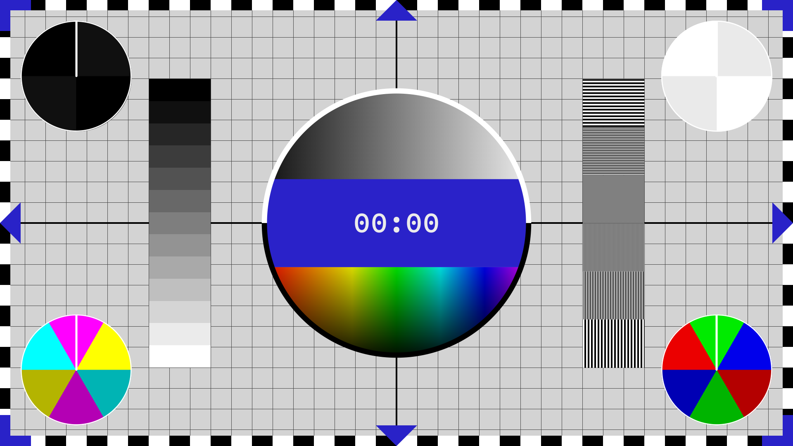

# dex test content

## animations

### `dex-test-card`

purpose:

* show full screen resolution with some test patterns
* show circle animations to check for seamless playback

base image created with [Kards by Alteka Solutions](https://alteka.solutions/kards)

see also [SRI Visualizer™ Digital Video Test Pattern](https://www.sri.com/product/visualizer-test-pattern/) for inspiration on how to improve stress testing.
